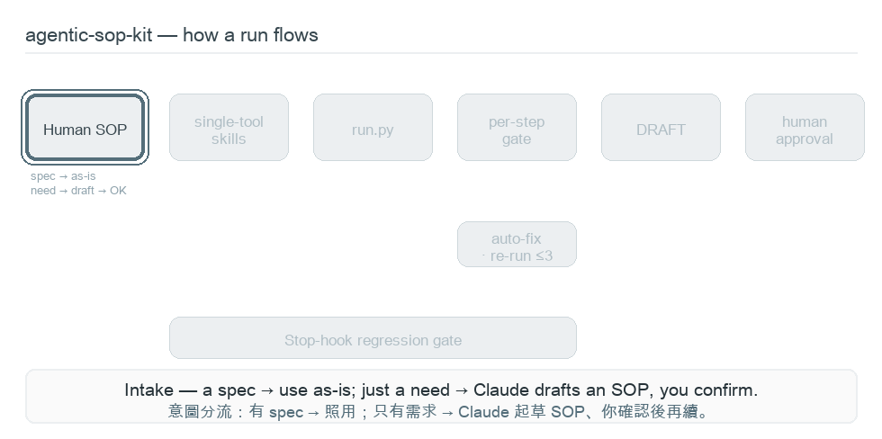
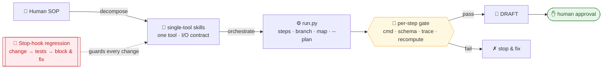

# agentic-sop-to-work

[](https://claude.com/claude-code) [](LICENSE) [](plugins/agentic-sop-kit/.claude-plugin/plugin.json) [](plugins/agentic-sop-kit/skills)

> **Loop Engineering** — make an agent's loop produce **verifiable progress**, stay **honest**, and stay **bounded**, by deterministic mechanism rather than vibes. `agentic-sop-kit` is the reference toolkit: it turns a human SOP into a **controlled loop**, not a one-shot script — no fabrication, no "mega-agent" rot.
> **Loop Engineering** — 用確定性機制(不是 vibes)讓 agent 的迴圈**每次迭代產生可驗證進度、不自我欺騙、不失控**。`agentic-sop-kit` 是它的參考工具包:把人工 SOP 變成一條**受控迴圈**——不臆造、不退化成 mega agent。

```
/plugin marketplace add s0912758806p/agentic-sop-to-work
/plugin install agentic-sop-kit@agentic-sop-to-work
/reload-plugins
```

**🌐 [English](#english) ・ [繁體中文](#繁體中文)**

### 🗺️ At a glance · 運作一覽



*Human SOP → single-tool skills → orchestrated flow (gated · branch · map) → DRAFT → human approval; a Stop-hook regression gate guards every change.<br>Human SOP → 單一工具 skill → 編排流程（閘門・分支・map）→ DRAFT → 人核准；Stop-hook 回歸閘門守住每次變更。*

<details>
<summary>靜態圖 / static diagram</summary>



</details>

### 🔁 The loop, engineered · 受控迴圈的三不變量

`agentic-sop-kit` makes the loop a **controlled** one — three deterministic invariants, human-owned at the controlled/destructive edges:
- **Bounded termination · 有界終止** — budget (count) **+ stall (progress)**: stop when iterations stop producing verifiable progress, not only when retries run out.
- **Observable health · 可觀測健康** — a coverage drop **hard-gates**; slowdown / flaky surface as advisory.
- **Bounded state · 有界狀態** — the regression log auto-rotates; run dirs prune on demand (human-authorized).

*"Human SOP → workflow" is **one application** of this loop; the same loop-control applies to any agent loop.*

---

## English

**What.** `agentic-sop-kit` is a **Loop Engineering** toolkit: it turns a process you do by hand (a "Human SOP") into a **controlled agentic loop** an LLM can run safely and repeatably — with bounded termination, observable health, and bounded state. A methodology + portable toolkit — not a chatbot. Built for regulated / high-stakes / must-be-correct work.

**Why it's safe** — it blocks the predictable LLM failures:
- **Fabrication** → facts come only from inputs; gaps marked `【待補】`, never invented.
- **Fake autonomy** → deterministic work in code; hard gates are hermetic & LLM-free (self-eval only advisory, capped).
- **Unaccountable output** → every output is a **DRAFT**; controlled / high-risk calls stay human-owned.
- **Mega-agent rot** → an audit skill + a Stop-hook **regression gate** that re-verifies on every change.

**What you get**

| | |
|---|---|
| **3 Skills** (auto-trigger by intent) | `six-rung-ladder` — minimalist "should I build this at all?" filter (**decide**) · `agentic-sop` — methodology + entry point + smart intake (**build**) · `agentic-workflow-audit` — read-only mega-agent auditor (**audit**) |
| **Command** `/agentic-sop-kit:sop-flow` | runs the kit's orchestration, reports a DRAFT |
| **Hooks** (project-scoped) | `SessionStart` dep-check · `Stop` regression gate — **no-op until a project adopts the kit** |
| **Portable kit** `kit/` | copy-into-any-project methodology + runnable example |
| **Plugin** `alcoa-guard` | ALCOA+ data-integrity linter — deterministic checks for Attributable / Contemporaneous / Complete / Accurate / Consistent; surfaces the human-judgment slice as a `【待補】` checklist; pure stdlib; report is a DRAFT |
| **Plugin** `plugin-forge` | Claude Code plugin linter + scaffolder — `lint` validates a plugin or whole marketplace against a house grammar (strict superset of manifest/frontmatter checks + stdlib-only, hook-protocol, and test-harness invariants); `scaffold` generates a grammar-conformant plugin skeleton; self-hosting; pure stdlib |

**Engine (`run.py`)** — deterministic, code-decided, additive:
- **Per-step gates** (block on fail, zero LLM): `cmd_gate` · `schema_gate` · `trace_gate` (no fabrication) · `recompute_gate`.
- **`cmd` steps** (allowlisted; mutations need `--allow-mutations`) · **`--plan`** dry-run (lists every step + validates branch gotos).
- **`branch`** (forward-only) · **`map_over`** (per-item) — control flow in code, never the model.
- **Examples** — dependency-free FE / BE / DB / AI flows in [`kit/workflow/examples/`](plugins/agentic-sop-kit/kit/workflow/examples/).
- **Capped auto fix-loop** — on a gate failure, `/sop-flow` auto-fixes & re-runs (`run.py --max-fix-retries`; code-enforced per run-id, capped by `SOPKIT_MAX_FIX_RETRIES`, default 3 — the same knob as the Stop-hook regression loop); exhausted → stop for a human; never patches output to pass.
- **Loop control** (Loop Engineering, in [`kit/lib/loop/`](plugins/agentic-sop-kit/kit/lib/loop/)) — keeps the loop bounded, observed, and bounded-in-state: **stall** stops on no verifiable progress (`SOPKIT_STALL_WINDOW`); **health** hard-gates a coverage drop and flags slowdown/flaky (advisory); **state** auto-rotates the run log and prunes run dirs on demand (`run.py --prune`). All deterministic.

**Iron rules** — facts only from inputs (`【待補】` for gaps) · deterministic work in code, gates hermetic & LLM-free · DRAFT + human approval · gates check truth, not keywords. **Real enforcement is the Stop-hook, not prose.**

**Install** — in Claude Code (incl. Claude Desktop's Code tab):
```
/plugin marketplace add s0912758806p/agentic-sop-to-work
/plugin install agentic-sop-kit@agentic-sop-to-work
/reload-plugins      # or restart the session
```
Requires **Python 3.8+** as `python3` (macOS/Linux out of the box; on Windows ensure `python3` resolves). Verify: `/help` lists `/agentic-sop-kit:sop-flow`.

**Build your own flow** — adopt the kit: `python3 <plugin>/kit/bootstrap.py --project <dir>` → scaffold a step: `new_skill.py --name <x>` (fill `DEPS` / `run()`) → wire `workflow/flow.json` → make it conversation-triggerable: `export_claude_skill.py --skill <x>`. Details: [`kit/SOP.md`](plugins/agentic-sop-kit/kit/SOP.md).

**Layout**
```
agentic-sop-to-work/
├── .claude-plugin/marketplace.json
└── plugins/agentic-sop-kit/
    ├── .claude-plugin/plugin.json · skills/ · commands/ · hooks/
    └── kit/   # portable kit: lib/ · workflow/ · tests/ · templates/ · examples/ · SOP.md
```

**License** — MIT ([`LICENSE`](LICENSE) · [`NOTICE`](NOTICE)); keep the copyright/license notice in copies, including single files. Updating: `git push` → users run `/plugin marketplace update agentic-sop-to-work`; bump `plugin.json` `version` on each meaningful change.

---

## 繁體中文

**是什麼。** `agentic-sop-kit` 是一套 **Loop Engineering** 工具包：把你手動做的流程（Human SOP）工程化成 LLM 能**安全、可重複**執行的**受控 agentic 迴圈**——有界終止 ＋ 可觀測健康 ＋ 有界狀態。是一套方法論 ＋ 可攜工具包，不是聊天機器人。為受監管／高風險／不能錯的工作而生。

**為何可信** — 逐一封堵 LLM 的可預期失敗：
- **臆造** → 事實只來自輸入；缺的標 `【待補】`，絕不杜撰。
- **假自主** → 確定性的事用程式；硬閘門 hermetic、零 LLM（自評只能 advisory 且封頂）。
- **無人負責的產出** → 產出一律 **DRAFT**；受控／高風險判定永遠由人擁有。
- **mega-agent 退化** → 稽核 skill ＋ Stop-hook **回歸閘門**，每次變更重新驗證。

**你會得到**

| | |
|---|---|
| **3 支 Skills**（依意圖自動觸發） | `six-rung-ladder` —「到底該不該做」的極簡過濾網（**decide**） · `agentic-sop` — 方法論與入口＋智慧意圖分流（**build**） · `agentic-workflow-audit` — 唯讀的 mega-agent 稽核者（**audit**） |
| **指令** `/agentic-sop-kit:sop-flow` | 跑 kit 的編排、回報 DRAFT |
| **Hooks**（專案範圍） | `SessionStart` 依賴檢查 · `Stop` 回歸閘門 — **專案未導入 kit 前一律 no-op** |
| **可攜 kit** `kit/` | 複製到任何專案就能用的方法論 ＋ 可運行範例 |
| **Plugin** `alcoa-guard` | ALCOA+ 資料完整性 linter — 確定性檢查 Attributable／Contemporaneous／Complete／Accurate／Consistent；人判部分呈現為 `【待補】` checklist；純 stdlib；產出為 DRAFT |
| **Plugin** `plugin-forge` | Claude Code plugin linter + scaffolder — `lint` 依 house grammar 驗證單一 plugin 或整個 marketplace（manifest／frontmatter 檢查的嚴格超集＋stdlib-only、hook-protocol、test-harness 不變量）；`scaffold` 產生符合 grammar 的 plugin 骨架；自我宿主；純 stdlib |

**引擎（`run.py`）** — 確定性、由程式決定、附加式：
- **每步硬閘門**（fail 即停、零 LLM）：`cmd_gate` · `schema_gate` · `trace_gate`（防臆造）· `recompute_gate`。
- **`cmd` 步驟**（白名單；會改動環境的需 `--allow-mutations`）· **`--plan`** 乾跑（列出每步＋靜態驗證 branch goto）。
- **`branch`**（forward-only）· **`map_over`**（逐項）— 控制流由程式決定，不交給模型。
- **範例** — 免依賴的 FE／BE／DB／AI 流程：[`kit/workflow/examples/`](plugins/agentic-sop-kit/kit/workflow/examples/)。
- **封頂自動修復 fix-loop**——閘門失敗時 `/sop-flow` 自動修復並重跑（`run.py --max-fix-retries`，依 run-id 程式強制上限；與 Stop-hook 回歸共用 `SOPKIT_MAX_FIX_RETRIES`、預設 3）；用盡才停下交人；永不為過關竄改輸出。
- **迴圈控制**（Loop Engineering，位於 [`kit/lib/loop/`](plugins/agentic-sop-kit/kit/lib/loop/)）——把迴圈維持**有界、可觀測、狀態有界**：**stall** 在無可驗證進度時早停（`SOPKIT_STALL_WINDOW`）；**health** 對覆蓋縮水硬擋、對變慢/flaky 給 advisory；**state** 自動輪替 run log、按需 `run.py --prune` 清理 run 目錄。全確定性。

**鐵則** — 事實只來自輸入（缺標 `【待補】`）· 確定性用程式、閘門 hermetic 零 LLM · DRAFT ＋ 人核准 · 閘門查真相不查關鍵字。**真正的強制力在 Stop-hook，不在散文。**

**安裝** — 在 Claude Code（含 Claude Desktop 的 Code 分頁）：
```
/plugin marketplace add s0912758806p/agentic-sop-to-work
/plugin install agentic-sop-kit@agentic-sop-to-work
/reload-plugins      # 或重開 session
```
需 **Python 3.8+** 且能以 `python3` 呼叫（macOS／Linux 開箱即用；Windows 請確保 `python3` 可解析）。驗證：`/help` 應看到 `/agentic-sop-kit:sop-flow`。

**建你自己的流程** — 導入 kit：`python3 <plugin>/kit/bootstrap.py --project <dir>` → scaffold 一步：`new_skill.py --name <x>`（填 `DEPS` / `run()`）→ 在 `workflow/flow.json` 接線 → 讓它對話可觸發：`export_claude_skill.py --skill <x>`。詳見 [`kit/SOP.md`](plugins/agentic-sop-kit/kit/SOP.md)。

**結構**
```
agentic-sop-to-work/
├── .claude-plugin/marketplace.json
└── plugins/agentic-sop-kit/
    ├── .claude-plugin/plugin.json · skills/ · commands/ · hooks/
    └── kit/   # 可攜 kit：lib/ · workflow/ · tests/ · templates/ · examples/ · SOP.md
```

**授權** — MIT（[`LICENSE`](LICENSE) · [`NOTICE`](NOTICE)）；副本需保留版權／授權聲明，含單一檔案。更新：`git push` → 使用者跑 `/plugin marketplace update agentic-sop-to-work`；每次有意義變更調高 `plugin.json` 的 `version`。
