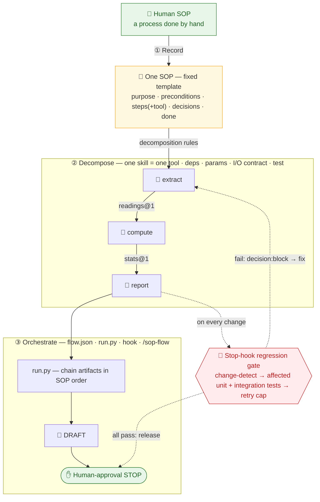

# agentic-sop-to-work

[](https://claude.com/claude-code) [](LICENSE) [](plugins/agentic-sop-kit/.claude-plugin/plugin.json) [](plugins/agentic-sop-kit/skills)

> Turn human SOPs into **deterministic, gated, human-approved** agentic workflows — and keep them from quietly rotting back into a "mega agent."
> 把人工 SOP 變成「**確定性引擎 ＋ 誠實硬閘門 ＋ 人核准**」的 agentic workflow，並防止它悄悄退化回「mega agent」。

A [Claude Code](https://claude.com/claude-code) **plugin marketplace** that publishes one plugin — **`agentic-sop-kit`** — installable by anyone in seconds.

**🌐 Language / 語言： [English](#english) ・ [繁體中文](#繁體中文)**

```
/plugin marketplace add s0912758806p/agentic-sop-to-work
/plugin install agentic-sop-kit@agentic-sop-to-work
/reload-plugins
```

### 🗺️ The three-stage chain · 三段鏈



*Human SOP → single-tool Skills → orchestrated Workflow — a Stop-hook regression gate guards every change, and every output stops for human approval.<br>Human SOP → 單一工具 Skill → 編排成 Workflow——Stop-hook 回歸閘門守住每次變更，每個產出都停在人核准。*

---

## English

### What it is
`agentic-sop-kit` is a **methodology + portable toolkit** for one job: taking a process a human does by hand (a "Human SOP") and engineering it into an **agentic workflow** that an LLM agent can run safely and repeatably — without making things up, and without collapsing into one giant do-everything prompt.

It does **not** give you a chatbot. It gives you a discipline (and the code that enforces it) for building agent workflows you can trust in regulated, high-stakes, or simply must-be-correct settings.

### The problem it solves
LLM agents fail in predictable ways. This kit is built to block each one:

| Failure mode | The guardrail |
|---|---|
| **Fabrication** — the model invents an ID, date, number, or conclusion that flows downstream as "fact." | Facts may come **only** from inputs. Anything missing is marked `【待補】` (to-be-filled), never invented. |
| **Fake autonomy** — a weak "LLM grades its own work" gate that the model games. | Anything deterministic is done in **code**, not the LLM. Hard gates are deterministic and hermetic; LLM self-evaluation is advisory only and capped. |
| **Unaccountable output** — a confident answer auto-filed as the system of record. | Every output is a **DRAFT for human approval**. Controlled / high-risk decisions are always human-owned. |
| **Mega-agent rot** — code that looks modular but whose control flow is all tangled together. | A second skill **audits** the structure; a Stop-hook **regression gate** re-verifies on every change. |

### What's inside the plugin
| Component | What it does |
|---|---|
| **Skills** (auto-invoked by Claude based on intent) | **`agentic-sop`** — the methodology and entry point for turning a Human SOP into a governed workflow. **`agentic-workflow-audit`** — a read-only auditor that decides whether a project is a *real* decomposed workflow or a disguised mega-agent. |
| **Command** `/agentic-sop-kit:sop-flow` | Runs the kit's `extract → compute → report` orchestration against the current project and reports the **DRAFT** result. |
| **Hooks** (project-scoped) | `SessionStart` → dependency check; `Stop` → **automatic regression gate**. They fire **only** when the current project has adopted the kit, and no-op everywhere else — so installing this plugin globally never disrupts unrelated projects. |
| **Portable kit** (`kit/`) | A copy-into-any-project methodology + runnable example: `bootstrap.py`, `SOP.md`, `lib/`, `workflow/`, `tests/`, `templates/`, and example skills. |

> **Which load and auto-trigger?** Only the two **Skills** above are loaded by Claude and fire from conversation. The example tool skills in `kit/` (`extract`/`compute`/`report`) are **not** conversation-triggered — they run deterministically via `/sop-flow` / `run.py`.

### How it works — the three-stage chain
```
Human SOP ──(1: record)──▶ one SOP (fixed template)
          ──(2: decompose)──▶ N single-tool skills (each self-contained, parameterized, with an I/O contract)
          ──(3: orchestrate)──▶ flow.json + run.py + hook + slash command (A→B→C, wired automatically)
```

**Stage 1 — Human SOP.** Record the manual process in a fixed template: purpose, preconditions, step-by-step (each step names *which tool* it uses), decision points, and completion criteria.

**Stage 2 — Tool Skills.** Apply the decomposition rules: **one skill = one tool**; dependencies declared in full and checked at runtime (missing → loud error, never silent); **zero hardcoding** (project-specific values are parameterized); an explicit JSON **artifact** I/O contract (`{schema, produced_by, data, trace}`); each skill independently reusable; and **every new skill registers a test** in `tests/registry.json`.

**Stage 3 — Agentic Workflow.** Wire the skills in SOP order (`workflow/flow.json`), run them with `run.py` (which chains artifacts, produces a run manifest, and **stops for human approval**), and install the command + hooks so an agent can trigger the flow.

Each tool runs the same **seven-stage loop**: `intake → classify/pre-check → deterministic layer (code) → generative layer (Claude, organizes inputs only) → assemble DRAFT → gate self-eval (≤2×) → review package → human-approval STOP`.

### The key design: real enforcement lives in the hook, not in prose
A skill is a *prompt* — probabilistic guidance the model can drift from. The actual guarantee comes from the **Stop-hook regression gate** (`tests/verify.py`):

1. **Change detection** via content-hash snapshot (no git dependency, works across machines) — nothing changed since the last pass → it exits without running tests.
2. On change → it runs **two layers**: the *affected* skills' unit tests (shared-layer edits trigger a full run) + the integration test for the whole workflow.
3. It appends a **regression record** to `tests/regression_log.jsonl`.
4. **Verdict**: all pass → release; any fail → the Stop hook returns `decision:block` and **feeds the failure back to the agent to fix**. A retry cap (`SOPKIT_MAX_FIX_RETRIES`, default 3) plus the `stop_hook_active` flag prevents an infinite fix-fail loop.

> Want a project to *actually* be gated? Adopt the kit's `hooks/` into it. The prose reminds; the hook enforces.

### The iron rules (and why)
- **Facts come only from inputs**; mark gaps `【待補】`, never fabricate IDs/dates/names/conclusions — fabrication is treated as fact downstream and poisons the whole chain.
- **Deterministic work is done in code, not the LLM.** Hard gates must be deterministic and hermetic; LLM self-eval is advisory and capped — a weak gate is fake autonomy.
- **DRAFT + human-approval STOP**; controlled / high-risk judgments are always human-owned.
- **Gates check truth, not form** — never use token overlap / keyword presence / `grep` for an ID as a hard gate; verify against the authoritative source.

### Install
In Claude Code (including the **Code tab** of Claude Desktop):
```
/plugin marketplace add s0912758806p/agentic-sop-to-work
/plugin install agentic-sop-kit@agentic-sop-to-work
/reload-plugins      # or restart the session
```
> Or with the full URL: `/plugin marketplace add https://github.com/s0912758806p/agentic-sop-to-work`

Verify: `/help` should list `/agentic-sop-kit:sop-flow`; the two skills auto-trigger by description.

**Requirements:** Python **3.8+** on PATH as `python3` (the hooks and kit run via `python3`). macOS/Linux work out of the box; on Windows, ensure `python3` resolves (e.g. via the `py` launcher) or run the kit commands manually.

### Quick start — build your own A→B→C flow
1. Adopt the kit into a target project (copies the kit, installs `/sop-flow`, merges the Stop-hook):
   ```
   python3 "<plugin install path>/kit/bootstrap.py" --project /path/to/project
   ```
2. Write your Human SOP from `templates/human_sop_template.md` (mark the tool for each step).
3. For each *step × tool*, copy `templates/skill_template/` into `skills/<name>/`, then fill in `DEPS`, the I/O schema, and `run()`.
4. List the steps in SOP order in `workflow/flow.json`, then verify: `python3 check_deps.py` → `python3 workflow/run.py`.

### Repository structure
```
agentic-sop-to-work/
├── .claude-plugin/marketplace.json     # marketplace manifest (name = agentic-sop-to-work)
├── LICENSE                             # MIT
└── plugins/
    └── agentic-sop-kit/                # the plugin (source: "./plugins/agentic-sop-kit")
        ├── .claude-plugin/plugin.json
        ├── skills/{agentic-sop,agentic-workflow-audit}/SKILL.md
        ├── commands/sop-flow.md
        ├── hooks/{hooks.json,stop_gate.py,session_check.py}
        └── kit/                        # the bundled, portable agentic-sop-kit
```

### Updating
After you change the plugin, `git push`; users run `/plugin marketplace update agentic-sop-to-work` to get the latest (or remove and re-add it). **Bump the `version` in `plugins/agentic-sop-kit/.claude-plugin/plugin.json` on every meaningful change** so Claude Code knows an update exists.

### License & attribution
MIT — see [`LICENSE`](LICENSE) and [`NOTICE`](NOTICE). You may use, modify, and redistribute this freely, **but the MIT License requires keeping the copyright and license notice** in copies — including individual files (e.g. a single skill or `kit/lib/kit.py`). Canonical source: <https://github.com/s0912758806p/agentic-sop-to-work> — please keep attribution when reusing.

---

## 繁體中文

### 這是什麼
`agentic-sop-kit` 是一套專做一件事的**方法論 ＋ 可攜工具包**：把「人工流程（Human SOP）」工程化成 LLM agent 能**安全、可重複**執行的 **agentic workflow**——過程中不臆造事實，也不讓它退化成一個包山包海的巨型 prompt。

它**不是**聊天機器人，而是一套紀律（以及強制這套紀律的程式），讓你在受監管、高風險、或單純「不能錯」的場景裡，建出值得信任的 agent 工作流。

### 解決什麼問題
LLM agent 的失敗是可預期的，本 kit 逐一封堵：

| 失敗模式 | 對應防線 |
|---|---|
| **臆造** — 模型自己生出編號／日期／數字／結論，被下游當成「事實」。 | 事實**只能**來自輸入；缺的標 `【待補】`，絕不杜撰。 |
| **假自主** — 用「LLM 自評自己的成果」這種弱閘門，模型替自己放水。 | 確定性的事一律用**程式**做，不用 LLM；硬閘門必須確定性、hermetic；LLM 自評只能 advisory 且封頂。 |
| **無人負責的產出** — 一個自信的答案被自動歸檔成系統紀錄。 | 產出一律是 **DRAFT、待人核准**；受控／高風險判定永遠由人擁有。 |
| **mega-agent 退化** — 程式看起來模組化，控制流其實全攪在一起。 | 第二支 skill 專門**稽核**結構；Stop-hook **回歸閘門**在每次變更後重新驗證。 |

### Plugin 內容
| 元件 | 功用 |
|---|---|
| **Skills**（Claude 依意圖自動觸發） | **`agentic-sop`** — 把 Human SOP 工程化成可治理工作流的方法論與落地入口。**`agentic-workflow-audit`** — 唯讀稽核者，判定一個專案是*真*拆解式 workflow，還是偽裝成模組化的 mega-agent。 |
| **指令** `/agentic-sop-kit:sop-flow` | 對目前專案跑 kit 的 `extract → compute → report` 編排，回報 **DRAFT** 結果。 |
| **Hooks**（專案範圍） | `SessionStart` → 依賴檢查；`Stop` → **自動回歸閘門**。**只有**當目前專案導入了 kit 才會啟動，其餘一律 no-op——所以全域安裝本 plugin 不會干擾無關專案。 |
| **可攜 kit**（`kit/`） | 複製到任何專案就能用的方法論 ＋ 可運行範例：`bootstrap.py`、`SOP.md`、`lib/`、`workflow/`、`tests/`、`templates/` 與範例 skills。 |

> **哪些會被載入、自動觸發？** 只有上面那兩支 **Skills** 會被 Claude 載入、由對話觸發。`kit/` 裡的範例工具 skill（`extract`／`compute`／`report`）**不會**對話觸發——它們由 `/sop-flow`／`run.py` 確定性執行。

### 怎麼運作 — 三段鏈
```
Human SOP ──(1: 記錄)──▶ 一份 SOP（固定模板）
          ──(2: 拆解)──▶ N 個單一工具 skill（各自自足、參數化、有 I/O 契約）
          ──(3: 編排)──▶ flow.json + run.py + hook + slash command（A→B→C 自動串接）
```

**階段 1 — Human SOP。** 用固定模板記錄人工流程：目的、前置條件、逐步操作（每步標明*用哪個工具*）、判斷點、完成條件。

**階段 2 — 工具 Skill。** 套用拆解規則：**一 skill 一工具**；依賴列全並於執行時檢查（缺項即明確報錯，絕不靜默）；**零硬編碼**（專案專屬值一律參數化）；明確的 JSON **artifact** I/O 契約（`{schema, produced_by, data, trace}`）；每個 skill 可獨立抽出重用；且**每新增一個 skill 就在 `tests/registry.json` 登記一支測試**。

**階段 3 — Agentic Workflow。** 依 SOP 順序在 `workflow/flow.json` 接線，用 `run.py` 執行（串接 artifact、產出 run manifest，並**停下來等人核准**），再裝上 command ＋ hooks 讓 agent 能觸發流程。

每支工具都跑同一條**七階段迴圈**：`intake → 分類／前置檢查 → 確定性層（程式）→ 生成層（Claude，只整理輸入）→ 組裝 DRAFT → 閘門自評（≤2 次）→ 覆核包 → 人核准 STOP`。

### 關鍵設計：真正的強制力在 hook，不在散文
skill 本質是一段 *prompt*——機率性的指引，模型會漂移。真正的保證來自 **Stop-hook 回歸閘門**（`tests/verify.py`）：

1. **變更偵測**：用內容雜湊快照（不依賴 git、跨環境可用）——自上次通過後無變動 → 直接結束、不跑測試。
2. 有變動 → 跑**兩層**：*受影響* skill 的單元測試（動到共用層則全跑）＋ 整條 workflow 的整合測試。
3. 把**回歸紀錄**寫進 `tests/regression_log.jsonl`。
4. **判定**：全 pass → 放行；任一 fail → Stop hook 回傳 `decision:block`，並**把失敗詳情餵回 agent 去修**。重試上限（`SOPKIT_MAX_FIX_RETRIES`，預設 3）＋ `stop_hook_active` 旗標，杜絕「失敗→修→再觸發→再失敗」的無限迴圈。

> 想讓某專案*真的*被擋？把 kit 的 `hooks/` 裝進去。散文只是提醒，hook 才是強制。

### 跨專案鐵則（與理由）
- **事實只來自輸入**；缺標 `【待補】`，絕不臆造編號／日期／姓名／結論——臆造會在下游被當成事實，汙染整條鏈。
- **確定性的事用程式、不用 LLM**；硬閘門必須確定性、hermetic；LLM 自評一律 advisory 且封頂——弱閘門＝假自主。
- **DRAFT ＋ 人核准 STOP**；受控／高風險判定永遠由人擁有。
- **閘門查真相、不查形式**——別用 token 重疊／關鍵字出現／`grep` 編號當硬閘門，要對權威來源核對。

### 安裝
在 Claude Code（含 Claude Desktop 的 **Code 分頁**）執行：
```
/plugin marketplace add s0912758806p/agentic-sop-to-work
/plugin install agentic-sop-kit@agentic-sop-to-work
/reload-plugins      # 或重開 session
```
> 也可用完整網址：`/plugin marketplace add https://github.com/s0912758806p/agentic-sop-to-work`

驗證：`/help` 應看到 `/agentic-sop-kit:sop-flow`；兩支 skill 會依描述自動觸發。

**需求：** 系統需有 Python **3.8+** 且能以 `python3` 呼叫（hooks 與 kit 都以 `python3` 執行）。macOS／Linux 開箱即用；Windows 請確保 `python3` 可解析（如透過 `py` launcher），或手動執行對應指令。

### 快速開始 — 建你自己的 A→B→C 流程
1. 把 kit 導入目標專案（複製 kit、裝 `/sop-flow`、合併 Stop-hook）：
   ```
   python3 "<plugin 安裝路徑>/kit/bootstrap.py" --project /path/to/project
   ```
2. 用 `templates/human_sop_template.md` 寫下你的 Human SOP（每步標出工具）。
3. 每個*步驟 × 工具*用 `templates/skill_template/` 複製成 `skills/<name>/`，填入 `DEPS`、I/O schema 與 `run()`。
4. 在 `workflow/flow.json` 依 SOP 順序列出步驟，再驗證：`python3 check_deps.py` → `python3 workflow/run.py`。

### Repo 結構
```
agentic-sop-to-work/
├── .claude-plugin/marketplace.json     # marketplace 清單（名稱 = agentic-sop-to-work）
├── LICENSE                             # MIT
└── plugins/
    └── agentic-sop-kit/                # plugin（source: "./plugins/agentic-sop-kit"）
        ├── .claude-plugin/plugin.json
        ├── skills/{agentic-sop,agentic-workflow-audit}/SKILL.md
        ├── commands/sop-flow.md
        ├── hooks/{hooks.json,stop_gate.py,session_check.py}
        └── kit/                        # 內附、可攜的 agentic-sop-kit
```

### 更新
改完 plugin 內容後 `git push`；使用者端執行 `/plugin marketplace update agentic-sop-to-work` 取得最新版（或移除後重加）。**每次有意義的變更都調高 `plugins/agentic-sop-kit/.claude-plugin/plugin.json` 的 `version`**，Claude Code 才認得出有更新。

### 授權與標註
MIT — 見 [`LICENSE`](LICENSE) 與 [`NOTICE`](NOTICE)。你可自由使用、修改、再散布，**但 MIT 授權要求在副本中保留版權與授權聲明**——包括單一檔案（例如某個 skill 或 `kit/lib/kit.py`）。正式來源：<https://github.com/s0912758806p/agentic-sop-to-work>——再利用時請保留出處標註。
