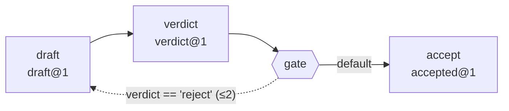

# agentic-sop-kit — 分享 / 安裝說明

**Loop Engineering 的參考工具包**——把「人工 SOP」轉成一條**受控迴圈**：一串各綁單一工具的 skill ＋ **編排層** ＋ 迴圈控制（`lib/loop/`：有界終止／可觀測健康／有界狀態）的可重用套件。
**整包可複製到任何專案，不改程式就能跑**（範例純 Python 標準庫）。方法論見 [`SOP.md`](SOP.md)。

**Graph Engineering（一個迴圈不夠用時）**：同一套不變量下降到節點與邊——具名節點、
有型別的交接邊、欄位級的狀態所有權、**有界退回邊**。詳見下方第 9 節。

---

## 1. 需求
- **Python ≥ 3.8**（範例流程與編排層只用標準庫；無第三方套件）。
- 想讓 agent 自動觸發：Claude Code（用其 slash command / hook）。**非必需**——直接 `python3` 也能跑。

## 2. 安裝（複製即用）

> **一鍵導入（推薦）**：`python3 ~/.claude/agentic-sop-kit/bootstrap.py --project /path/to/your-project` — 複製 kit ＋ 裝 `/sop-flow` slash command ＋ 合併 SessionStart/Stop hooks（冪等、不靜默覆蓋）。canonical kit 現位於 `~/.claude/agentic-sop-kit/`。下列為等效的手動步驟。
```bash
# 把整個資料夾複製到你的專案任意位置（路徑會自動相對解析，無硬編碼）
cp -r agentic-sop-kit /path/to/your-project/
cd /path/to/your-project

# (建議) 先檢查依賴 —— 缺什麼會明確告訴你，不會靜默壞掉
python3 agentic-sop-kit/check_deps.py
```

## 3. 跑範例流程（30 秒驗證）
```bash
python3 agentic-sop-kit/workflow/run.py
# → 依序跑 extract → compute → report，產出在 agentic-sop-kit/runs/<run_id>/
#   report.md（DRAFT 報告）、run_manifest.json（覆核包）

# 換自己的輸入：
python3 agentic-sop-kit/workflow/run.py --input /path/to/your_input.txt
```
看到 `✅ 流程完成 → …/report.md` 就成功了。產出是 **DRAFT，需人覆核**。

## 4. （選用）讓 agent 在 Claude Code 觸發
- **Slash command**：`mkdir -p .claude/commands && cp agentic-sop-kit/commands/sop-flow.md .claude/commands/` → 之後輸入 `/sop-flow`。
  （`mkdir -p` 必要：全新專案通常還沒有 `.claude/commands/`。）
- **Hook**（開場依賴檢查 + 停止前自動回歸驗證）：`mkdir -p .claude`；若無 `.claude/settings.json` 就以 `agentic-sop-kit/hooks/settings.snippet.json` 為起點建立，否則把其 `hooks` 區段（`SessionStart` + `Stop`）合併進去。
  - 若把 kit 放在 `agentic-sop-kit/` 以外的位置，記得改 snippet 內 `$CLAUDE_PROJECT_DIR/agentic-sop-kit/...` 路徑。

## 4b. 自動回歸驗證（更新不弄壞既有功能）
裝好上面的 **Stop hook** 後即生效，全自動：
- 每次 agent 準備停止前跑 `tests/verify.py`：**變更偵測**（SOP/任一 skill/編排層自上次通過後沒變 → 直接放行、不跑測試）→ 有變動才跑**單元層（受影響 skill）＋整合層（整條串接）**。
- 結果寫進 `tests/regression_log.jsonl`（時間、變更項、pass/fail、指標）。
- **全 pass = 正常**，放行；**任一 fail** → hook 以 `decision:block` 把失敗原因餵回 agent 去修；保留紀錄供人決定修正或回滾。
- **防迴圈**：`stop_hook_active` + 重試上限（`SOPKIT_MAX_FIX_RETRIES`，預設 3），達上限即停手、提示人工介入。同一上限亦套用於 `run.py` 的 in-run fix-loop（兩層共用一個旋鈕）。
  - fix-loop 為**雙終止**：budget（看次數，`SOPKIT_MAX_FIX_RETRIES`）＋ stall（看進度，`SOPKIT_STALL_WINDOW`，預設 2）——連續無可驗證進度（idle / A→B→A thrash）即確定性早停、拒絕重跑。
- **健康監測**：回歸迴圈附帶確定性健康讀數——覆蓋縮水（註冊測試數掉到基線下）走 `verify` exit 3 硬擋（接 Stop-hook）；變慢／flaky 為 advisory、不擋。刻意降覆蓋用 `verify.py --rebaseline`。
- **有界狀態**：迴圈 run-state 不無限長——`verify` 自動把 `regression_log.jsonl` 截到最近 `SOPKIT_STATE_KEEP_LOG`（200，且不低於保底 50，保住健康窗）；舊 run 目錄用 `run.py --prune`（人授權刪除，保留最新 `SOPKIT_STATE_KEEP_RUNS`=20）。
- 「更好」指標（步數/時間/成功率）只記入 log，由**人**回看趨勢判斷，hook 不自動下結論。

手動全量驗證（建立基線 / 不靠 hook）：`python3 agentic-sop-kit/tests/verify.py --all`

## 4c. 拓撲：把流程接成一張有界的圖（選用）

線性 `A→B→C` 之外，flow.json 可以宣告一張圖。四個旋鈕，全部**選擇性**：

| 宣告 | 意思 |
|------|------|
| `"gate": {"type":"schema_gate","args":{"schema_ref":"draft@1"}}` | **有型別的邊**：上游 tag 與 `data` 形狀都要對，否則硬失敗 |
| `"writes": ["draft"]` | 這個節點是 `draft` 欄位的**唯一** writer（兩個 writer 是靜態錯誤） |
| `"reads": ["draft"]` | 這個節點讀 `draft`；**所有**到達它的路徑都必須先寫過，否則靜態錯誤 |
| `{"goto":"draft","back":true,"max_revisits":2}` | **有界退回邊**：唯一能往後跳的方式，且必須帶上界 |

```bash
GRAPH=agentic-sop-kit/workflow/examples/graph.json
python3 agentic-sop-kit/workflow/run.py --flow "$GRAPH" --plan    # 靜態驗證拓撲，不合法 exit 2
python3 agentic-sop-kit/workflow/run.py --flow "$GRAPH" --graph   # 畫拓撲（Mermaid）
python3 agentic-sop-kit/workflow/run.py --flow "$GRAPH"           # 跑（三輪收斂，用掉宣告的 2 次重訪）
# 跑完看狀態：run_manifest.json 的 topology.owners（誰擁有哪個欄位）與 path_taken（實走路徑）
```

出貨的圖示範流程（此區塊由 `--graph` 生成，`tests/test_graph_docs.py` 逐位元綁住）：

<!-- BEGIN GENERATED: topology -->

<!-- END GENERATED: topology -->

- **狀態不是容器，是宣告**：沒有 `state.json`。欄位的值仍在該節點的 artifact 裡，
  `written_by` 就是那份 artifact 自己的 `produced_by`——不存在第二份會漂移的權威。
  誰擁有哪個欄位：`--plan` 會印出 owner 表，跑完後也記在 `run_manifest.json` 的 `topology.owners`。
- **退回不覆寫歷史**：重訪時前一次產物歸檔成 `<name>.visit<N>.<ext>`，
  並記在 manifest `path_taken` 的 `archived_previous`。
  （這正是選擇「宣告」而非中央 store 的理由——store 會覆寫，第一次嘗試就消失了。）
- **相容性**：以上四個旋鈕**一個都沒宣告時，產物與 manifest 鍵集合與改版前逐位元相同**——
  `schema` tag 仍只是標籤、不產生 `topology`/`path_taken`。
  由 `tests/integration/test_legacy_flow.py` 逐位元守住。
  （**唯一例外**：拓撲不合法一律拒跑，不因流程新舊而寬待——見下方第 9 節。）

## 5. 打造你自己的流程（A→B→C…）
1. 用 [`templates/human_sop_template.md`](templates/human_sop_template.md) 寫下你的人工 SOP（**每步標明用哪個工具**）。
2. 每個「步驟×工具」用 [`templates/skill_template/`](templates/skill_template/) 複製出一個 `skills/<name>/`，並**去掉 `.tmpl` 副檔名**（`tool.py.tmpl`→`tool.py`、`SKILL.md.tmpl`→`SKILL.md`），再填 `DEPS` / `--in,--out` / `run()`。
3. **同步登記測試**：寫 `tests/unit/test_<name>.py`，並在 [`tests/registry.json`](tests/registry.json) 的 `skills.<name>` 登記 `dir` 與 `tests`（漏登記會被 `verify.py` fail-loud 擋下）。
4. 在 [`workflow/flow.json`](workflow/flow.json) 按 SOP 順序列出 steps 與接線（上一步 `out` = 下一步 `in`）。
   要接成圖（型別邊／欄位所有權／有界退回邊）見第 4c 節。
5. `python3 agentic-sop-kit/check_deps.py` → `python3 agentic-sop-kit/workflow/run.py --plan`（靜態驗證拓撲）
   → `python3 agentic-sop-kit/workflow/run.py` → `python3 agentic-sop-kit/tests/verify.py --all` 驗證。

拆解規則與三階段細節見 [`SOP.md`](SOP.md)。

## 6. 自我驗收（對應任務驗收條件）
```bash
python3 agentic-sop-kit/check_deps.py        # (c) 依賴完整；缺項明確報錯並 exit 1
python3 agentic-sop-kit/workflow/run.py      # (a) 不改程式即跑通範例流程
```
（本說明即 (b)。）

## 7. 目錄
```
SOP.md  README.md  check_deps.py  requirements.txt
lib/kit.py                         # 可攜核心（路徑/依賴/artifact/編排進入點）
lib/graph.py  lib/schema.py        # 靜態拓撲分析 / schema 註冊表與型別驗證
lib/gates.py  lib/flow.py  lib/loop/   # 確定性閘門 / 控制流判定 / 迴圈控制
workflow/schemas/                  # 每個 artifact tag 的欄位與型別宣告
templates/human_sop_template.md  templates/skill_template/
skills/extract|compute|report/     # 線性範例：各一個單一工具 skill（SKILL.md + tool.py）
skills/draft|verdict|accept/       # 圖範例：退回邊目標 / 判定來源 / 終端節點
workflow/flow.json  workflow/run.py  workflow/examples/
commands/sop-flow.md
hooks/settings.snippet.json  hooks/stop_regression.py   # SessionStart 依賴檢查 + Stop 自動回歸
tests/registry.json                # 受測功能登錄表（skill→單元測試 / 整合測試）
tests/unit/  tests/integration/  tests/verify.py        # 兩層測試 + 變更偵測驗證腳本
tests/regression_log.jsonl         # 回歸紀錄（執行後產生）
example/inputs/sample_readings.txt
runs/<run_id>/                     # 執行後產生（run-scoped；不覆蓋既有產物）
```

## 8. 設計保證
- **無硬編碼**：路徑相對 `lib/kit.py` 解析（或 `SOPKIT_ROOT` 覆寫）；專案專屬值走 `--in/--out`/env。
- **缺依賴明確報錯**：`kit.require_deps()` 列出全部缺項並中止（非靜默）。
- **單一工具 skill / 可獨立重用**：`skills/<name>/` + `lib/kit.py` 可單獨抽出到別專案。
- **DRAFT / 人核准**：產出永遠標 DRAFT，永不自動歸檔。
- **自動回歸把關**：Stop hook + 變更偵測，更新後只在「有變」時跑「受影響單元 + 整合」兩層；fail 自動回饋去修、`stop_hook_active`+重試上限防迴圈；指標只記 log 由人判趨勢。

## 9. 閘門與拓撲檢查（確定性、零 LLM）

**5 deterministic gates**（`lib/gates.py`，產出後驗、fail 即停）：

| Gate | 擋什麼 |
|------|--------|
| `cmd_gate` | 指令 exit 非 0（可另要求 stdout 含特定字樣） |
| `schema_gate` | 必填欄位缺失；給了 `schema_ref` 則**連 tag 與型別一起驗**（有型別的邊） |
| `trace_gate` | 值無法 verbatim 溯源到輸入 —— 防臆造 |
| `recompute_gate` | 宣稱的數字與重算結果不符 |
| `residual_gate` | 宣告為必填的欄位仍是【待補】（其他位置的【待補】是誠實空白，一律不擋） |

**靜態拓撲檢查**（`lib/graph.py`，`--plan` 期即判、exit 2）：不可達節點、read-before-write、
寫入衝突、無界環、退回邊宣告不實或缺上界、孤邊、被 goto 指到的重名、畸形步驟。
拓撲不合法**不必跑就知道**；**執行期套用完全相同的判定**（`graph.analyze` 是唯一權威，
不存在「某些問題只對某些流程算數」的例外）。

> 這兩張表的數字與名稱由 `tests/test_graph_docs.py` 綁到 `gates.REGISTRY` 與 `graph.analyze` 的實算值：
> 加了閘門或檢查卻沒改文件，測試會紅（fail-closed）。
