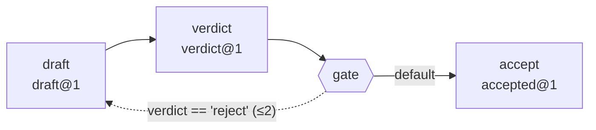

# 轉換 SOP：Human SOP → 工具 Skill → Agentic Workflow（可分享 / 跨環境 / 跨專案重用）

> **Loop Engineering 的方法論層**：把 Human SOP 工程化成一條**受控迴圈**——有界終止、可觀測健康、有界狀態（迴圈控制在 `lib/loop/`，感測在下方 gates）。
>
> **Graph Engineering（一個迴圈不夠用時）**：Loop Engineering 讓**一個**迴圈可信；把多個可信的迴圈接成一張**有界的圖**時，同一套不變量下降到**節點與邊**的粒度——
> **節點**＝一個工具的一步、**邊**＝有型別可驗證的交接契約、**狀態**＝節點宣告的 read-set / write-set、**退回邊**＝有界的反向條件邊。
> 三階段從此是 `記錄 → 拆解 → **拓撲宣告**`。
>
> **節點不是 agent。** 節點就是「一個工具的一步」；把工具換成模型的節點，習慣上會被叫做 agent，但 `一 skill 一工具` 一個字不改。
> 不釘這句，「一張 agent 的圖」會被拿去蓋 mega agent——正是本方法論存在的理由所要防的退化。

## 批次 map（map_over，循序 fan-out）
工具步驟可加 `map_over: "<key>"`（指向**輸入 artifact data 的頂層清單鍵**）：引擎對清單**每一項**各跑一次該工具（依序、隔離），把每次輸出的 `data` 收進 `map@1` artifact 的 `data.items`（並附 `data.count`）。
`{"skill":"check","tool":"skills/check/tool.py","map_over":"items","in":"$RUN/x.json","out":"$RUN/y.json"}`
- **fail-loud**：任一項失敗即整步失敗（不靜默丟）。可在 map 步驟掛 `gate`（如 `recompute_gate` 驗 `count`）。
- 鍵為頂層、循序執行（並行屬 YAGNI、未做）。

## 條件分支與有界退回邊（branch）
flow.json 可放分支步驟，依**上一步 artifact 的 data** 由程式（非模型）決定走向：
`{"branch":"$RUN/c.json","cases":[{"when":{"path":"severity","op":"==","value":"OOS"},"goto":"investigate"},{"default":true,"goto":"release"}]}`
- `goto` 對應某步的 `skill`/`id`。**往前跳**永遠合法。
- **往後跳**（＝形成環）唯有宣告成**有界退回邊**才合法：
  `{"when":{...},"goto":"draft","back":true,"max_revisits":2}`
  缺 `back:true`、或 `max_revisits` 不是正整數、或宣告了 `back` 卻指向前方 → `--plan` 期即 **exit 2**。
- 舊規則（forward-only，`無迴圈`）從「**禁止**」改為「**有界才准**」：確定性沒有讓步，
  因為每個環都必須經過一條帶上界的退回邊，且 `lib/loop/` 的進度感測器會**逐邊**量測——
  同一條退回邊上連續相同的路由狀態即 `idle`，在撞上界之前就確定性早停（雙終止：先到者停）。
- 重訪不覆寫歷史：節點被退回重跑時，前一次的產物歸檔成 `<name>.visit<N>.<ext>`，
  並記在 `run_manifest.json` 的 `path_taken[].archived_previous`。
- 運算子白名單：`== != < <= > >= in exists`；型別不符回 false、不丟例外。
- 複雜判斷可由一支確定性 router skill 輸出 `data.route`，再用 `{"path":"route","op":"==",...}` 分流。

## 拓撲的靜態驗證（lib/graph.py）
`python3 workflow/run.py --plan` 除了列出操作，還把整張圖靜態驗證一遍，
任一項不合法即 **exit 2**——拓撲不合法**不必跑就知道**。
**執行期套用完全相同的判定**：`graph.analyze` 是唯一權威，沒有「某些問題只對某些流程算數」的例外。

| 檢查 | 抓什麼 |
|------|--------|
| 不可達節點 | 宣告了卻沒有任何路徑到得了 |
| read-before-write | 節點讀的欄位，不是在**所有**到達它的路徑上都被寫過 |
| 寫入衝突 | 兩個節點宣告寫同一欄位（所有權必須唯一） |
| 無界環 | 環上沒有任何一條宣告了 `max_revisits` 的退回邊 |
| 孤邊／重名／畸形步驟 | `goto` 指向不存在的步驟、被 goto 指到的重複命名、既無 tool/cmd/branch 的步驟 |

後兩類的細分碼共 11 種（`graph.analyze` 的 finding `code`）。
`read-before-write` 與 `唯一 writer` 是稽核條文「共享狀態**無誰給誰什麼的契約** = FAIL」的可執行版本：
**唯一宣告 writer ＋ 所有路徑保證寫過**，就是那份契約。狀態的值仍只存在 artifact 裡。

畫出來看：`python3 workflow/run.py --flow workflow/examples/graph.json --graph`（Mermaid ＋ 文字），
出貨的圖示範流程長這樣（此區塊由 `--graph` 生成，`tests/test_graph_docs.py` 逐位元綁住）：

<!-- BEGIN GENERATED: topology -->

<!-- END GENERATED: topology -->

## 執行期硬閘門（lib/gates.py）與步驟型態
flow.json 每步可選掛 deterministic 閘門（產出後驗、fail 即停）。共 **5 deterministic gates**：
`cmd_gate`（指令 exit 0）/ `schema_gate`（必填欄位；給了 `schema_ref` 就**連型別一起驗**）/
`trace_gate`（值須 verbatim 溯源、防臆造）/ `recompute_gate`（數字重算相符）/
`residual_gate`（宣告為必填的欄位仍是【待補】即擋；其他位置的【待補】是誠實空白，只計數不擋）。
指令型步驟：`{"cmd":"...","out":"...","gate":{"type":"cmd_gate"}}`；會改動環境的標 `"mutates":true`，需 `--allow-mutations` 才跑。
`python3 workflow/run.py --plan` 先列出所有操作（不執行），mutating 操作會標示。

本 kit 是一份**可複製到任何專案就能用**的轉換方法論 + 可運行範例。三個階段、各有**固定產物**與**交接介面**；
無硬編碼、依賴完整宣告（缺項明確報錯）。範例流程 `extract → compute → report` 是本 SOP 的 worked instance。

> 可攜性原則：所有路徑相對 kit 解析（`lib/kit.py::KIT_ROOT`，可被 `SOPKIT_ROOT` 覆寫）；專案專屬值一律參數化。

```
Human SOP ──(階段1: 記錄)──▶ 一份 SOP（固定模板）
            ──(階段2: 拆解規則)──▶ N 個單一工具 skill（各自依賴/參數化/I-O 介面）
            ──(階段3: 拓撲宣告)──▶ flow.json（節點/邊/型別/欄位所有權/退回邊）+ run.py + hook + slash command
```

---

## 階段 1 — Human SOP（以固定模板記錄人工流程）

產物：一份依 **`templates/human_sop_template.md`** 填寫的 SOP，**必含**：
1. **目的**（這份流程要達成什麼）
2. **前置條件**（開始前需具備的輸入/狀態/權限）
3. **逐步操作**（每一步：做什麼 + **用哪個工具**）
4. **判斷點**（哪裡需要分支/人為決定，條件為何）
5. **完成條件**（怎樣算完成、產物是什麼）

> 「每步用哪個工具」是階段 2 拆解的依據——一步一工具。

**這份產物怎麼來（intake 分流）**
- 使用者已給**正式 spec／既有 requirement 或 runner skill／已填好的本模板** → **照原樣採用**，直接進階段 2。
- 只有**自然語言需求** → 由 Claude 依本模板**起草** SOP（未知標【待補】、不臆造），**STOP 給人核准/修改**後再進階段 2。
- 草稿 SOP 是 **DRAFT**；此步屬生成層，**閘門/引擎不變**。

---

## 階段 2 — 工具 Skill（依拆解規則切成數個單一工具 skill）

### 拆解規則（Decomposition Rules）
1. **一 skill 一工具**：SOP 中每個「用到某工具」的步驟 → 一個 skill。跨工具的步驟必須再拆。
2. **依賴自足且完整**：每個 skill **只宣告自己那個工具**的依賴（工具/模組/環境變數/權限），且**列全**；
   執行時以 `kit.require_deps()` 檢查，**缺任一項明確報錯（拋 `MissingDeps`），絕不靜默失敗**。
3. **零硬編碼**：所有專案專屬值（路徑、專案名、設定）一律參數化（`--in/--out`、環境變數、config），程式內不得寫死。
4. **明確 I/O 介面**：定義與上下游 skill 交換的資料格式（本 kit 用 JSON **artifact**：`{schema, produced_by, data, trace}`）。
5. **可獨立抽出重用**：`skills/<name>/` + `lib/kit.py` 複製到別專案即可單獨運作（無專案耦合）。
6. **納入即登記測試**：每新增一個 skill，**同步**寫一支單元測試並登記到 **`tests/registry.json`**（受測功能登錄表）。
   `tests/verify.py` 會交叉比對 `flow.json`——任何流程用到卻未登記測試的 skill 會 **fail-loud（exit 3）**，杜絕「加了 skill 卻忘了測」。
7. **宣告 read-set / write-set**：節點在 flow.json 上宣告它讀哪些狀態欄位（`reads`）、寫哪些（`writes`）。
   一個欄位**只能有一個宣告 writer**；讀一個沒人在所有路徑上寫過的欄位是靜態錯誤。
   欄位的**值**不另外存——仍在該節點的 artifact 裡，`written_by` 就是現成的 `produced_by`。
   宣告是選擇性的：沒宣告就是今天的行為（見 README 的相容性一節）。

### 每個 skill 的產物
- `skills/<name>/SKILL.md`：宣告**單一工具**、**完整依賴**、**參數化介面**、**I/O schema**、**獨立重用**說明。
- `skills/<name>/tool.py`：頂層宣告 `DEPS`；`if __name__=='__main__': kit.skill_main(DEPS, WHO, run)`（自動 require_deps + 解析 `--in/--out`）。
- `tests/unit/test_<name>.py`：該 skill 的單元測試；並在 `tests/registry.json` 的 `skills.<name>` 登記其 `dir` 與 `tests`。
- 範本：`templates/skill_template/`。範例：`skills/extract|compute|report/`。

---

## 階段 3 — Agentic Workflow（編排層 + hook + slash command）

把零散的單一工具 skill **依 SOP 實際順序**串成完整流程：
- **`workflow/flow.json`**：宣告順序與 I/O 接線（`$INPUT`、`$RUN` 佔位；上一步 `out` = 下一步 `in`）。
- **`workflow/run.py`**：逐步以子程序跑各 skill、串接 artifact、產 run-scoped `run_manifest.json`、**人核准 STOP**；任一步失敗（含缺依賴）→ 立即停止、回報該步 stderr。 失敗時 manifest 帶 `failure{step,gate_type,message,artifact}`；`/sop-flow` 據此做**封頂自動修復**（同 run-id ≤ `--max-fix-retries` 次，程式強制上限），終點仍 DRAFT＋人核准。
- **`commands/sop-flow.md`**：slash command，讓 agent 在目標專案 `/sop-flow` 觸發流程。
- **`hooks/settings.snippet.json`**：hook 設定。
  - **SessionStart**：跑 `check_deps.py`，缺依賴在 session 開場就明確報錯。
  - **Stop**（自動回歸驗證）：`hooks/stop_regression.py` 在 agent 準備停止時跑 `tests/verify.py`——見下節。

---

## 自動回歸驗證（更新不弄壞既有功能）

每次 SOP/skill 更新後，由 **Stop hook** 自動把關，流程全自動：
- **受測功能登錄表 `tests/registry.json`**：每個 skill 的單元測試 + 整條 workflow 的整合測試的單一事實來源。
- **`tests/verify.py`**：
  1. **變更偵測**（內容雜湊快照，不依賴 git、跨環境可用）：自上次「通過」後 SOP/任一 skill/編排層無變動 → 直接結束、不跑測試。
  2. 有變動 → 跑**兩層**：單元層（**受影響** skill 各自的測試；動到 `lib/`、`workflow/`、`registry.json` 等共用層則全跑）＋整合層（整條 workflow 串接、交接資料正確、失敗會傳播）。
  3. 寫**回歸紀錄** `tests/regression_log.jsonl`（時間、變更項、pass/fail、指標）。
  4. **判定**：全 pass = 正常（放行）；任一 fail → exit 2。「更好」指標（步數/時間/成功率）只記入 log，由人回看趨勢，hook 不自動下結論。
- **`hooks/stop_regression.py`**（Stop hook）：
  - 全 pass / 無變更 → 放行停止。
  - 任一 fail → 以 `{"decision":"block","reason":…}` 把失敗詳情餵回 agent 去修；保留紀錄供人決定修正或回滾。
  - **防迴圈**：用 Stop hook 輸入的 `stop_hook_active` 旗標 + 持久重試計數設上限（`SOPKIT_MAX_FIX_RETRIES`，預設 3），達上限即停止再 block、改要求人工介入，杜絕「失敗→修→再觸發→再失敗」無限循環。
    - fix-loop 為**雙終止**：budget（看次數，`SOPKIT_MAX_FIX_RETRIES`）＋ stall（看進度，`SOPKIT_STALL_WINDOW`，預設 2）——連續無可驗證進度（idle / A→B→A thrash）即確定性早停、拒絕重跑。
- **健康監測**：回歸迴圈附帶確定性健康讀數——覆蓋縮水（註冊測試數掉到基線下）走 `verify` exit 3 硬擋（接 Stop-hook）；變慢／flaky 為 advisory、不擋。刻意降覆蓋用 `verify.py --rebaseline`。
- **有界狀態**：迴圈 run-state 不無限長——`verify` 自動把 `regression_log.jsonl` 截到最近 `SOPKIT_STATE_KEEP_LOG`（200，且不低於保底 50，保住健康窗）；舊 run 目錄用 `run.py --prune`（人授權刪除，保留最新 `SOPKIT_STATE_KEEP_RUNS`=20）。

> 手動全量驗證：`python3 tests/verify.py --all`（忽略變更偵測，建立基線/全跑）。

---

## 交接介面（Handoff Interface）規格
所有 skill 間以 JSON **artifact** 交換：
```json
{"schema": "<name@version>", "produced_by": "<skill>", "data": { ... }, "trace": [ {"value","source","locator"} ]}
```
- `schema` 標版本；`data` 為該步結果；`trace` 為來源追溯（逐層透傳）。
- 範例鏈：`readings@1`（extract）→ `stats@1`（compute）→ Markdown DRAFT（report）。

### schema 註冊表（讓 tag 有牙齒）
`workflow/schemas/<tag>.json` 逐一宣告每個 tag 的必填欄位與型別（極簡自寫格式，非 JSON Schema——
stdlib-only 由 `tests/test_no_third_party.py` 與 `plugin-forge lint --all --strict` 機械守著）。
一份宣告就三行：
```json
{"schema": "draft@1", "required": ["defects", "round"],
 "types": {"defects": "number", "round": "number", "addressed": "list"}}
```
邊上宣告 `"gate": {"type": "schema_gate", "args": {"schema_ref": "draft@1"}}` 後：
上游送來的 tag 不符、或 `data` 形狀不符 → **硬失敗**。

> **出貨只附「有被強制的」宣告。** `workflow/schemas/` 裡只有 `draft@1`／`verdict@1`／`accepted@1`
> 三份——因為只有它們被 `workflow/examples/graph.json` 真正拿 `schema_ref` 強制。
> 線性 demo 必須維持逐位元不變，所以它永遠不會用型別邊；替它（或替 `map@1`／`cmd@1`）預先附一份
> 宣告，等於出貨一份沒人檢查的文件。要用就自己加三行——**每一份出貨的宣告都應該被一次真實執行強制**。
沒宣告 `schema_ref` 時 `schema_gate` 行為與改版前逐字相同，`schema` tag 仍只是標籤。
型別詞彙刻意只有 `list / dict / str / number / bool`；嵌套與 enum 等第一個真實流程需要時再加（只寫最小可用）。

---

## 驗收（本 kit 已自證）
- **(a)** 整包複製到全新空白專案，**不改任何程式** → `python3 agentic-sop-kit/workflow/run.py` 跑通範例流程。
- **(b)** 見 `README.md`（分享/安裝說明），未參與開發者照做即可安裝使用。
- **(c)** `python3 agentic-sop-kit/check_deps.py` 彙總所有依賴；缺項**明確列出並 exit 1**（非靜默）。

## 用本 kit 新建一條流程（A→B→C…）
1. 用 `templates/human_sop_template.md` 寫下你的 Human SOP（標出每步工具）。
2. 依拆解規則，每個「步驟×工具」用 **`python3 new_skill.py --name <name>`** scaffold 出 `skills/<name>/`（自動去 `.tmpl`、替換名稱、建單元測試骨架並登記 `tests/registry.json`）；接著填 DEPS / I-O / run()。（也可手動複製 `templates/skill_template/`。）
3. 在 `workflow/flow.json` 按 SOP 順序列出 steps 與接線。
4. `python3 check_deps.py` → `python3 workflow/run.py` 驗證；安裝 `commands/` + `hooks/` 讓 agent 觸發。
5. **完成工具後**，用 **`python3 export_claude_skill.py --skill <name> --project .`**（或 `--all`）產出可被 Claude 載入、對話即可觸發的 **runner skill**（寫到 `.claude/skills/`）——它只去執行你那支確定性工具並回報 DRAFT，不讓模型自行重做（守住控制流鐵則）。導入時加 `bootstrap.py --with-claude-skills` 會順便產生；要收回已產生的 runner skill，用 `export_claude_skill.py --remove --skill <name> --project .`（或 `--all`，只刪本工具產生的、手改過的會被拒絕除非 `--force`）。

## 目錄結構
```
agentic-sop-kit/
  SOP.md                      # 本檔（方法論）
  README.md                   # 分享/安裝說明（驗收 b）
  check_deps.py               # 聚合依賴檢查（驗收 c）
  requirements.txt            # 依賴清單（範例純 stdlib）
  lib/kit.py                  # 可攜核心（路徑解析/依賴/artifact/編排進入點）
  lib/graph.py                # 靜態拓撲分析（節點/邊/欄位所有權/有界環）
  lib/schema.py               # schema 註冊表與型別驗證（讓交接邊有型別）
  lib/gates.py, lib/flow.py   # 確定性閘門 / 控制流判定
  lib/loop/                   # 迴圈控制（進度 stall、健康、有界狀態）
  workflow/schemas/           # 被強制的 artifact tag 的欄位與型別宣告
  templates/                  # human_sop_template.md + skill_template/
  skills/<name>/              # 單一工具 skill（SKILL.md + tool.py）
  workflow/flow.json,run.py   # 編排層（--plan 靜態驗證 / --graph 畫拓撲）
  commands/sop-flow.md        # slash command
  hooks/settings.snippet.json # hook 設定（SessionStart 依賴檢查 + Stop 自動回歸）
  hooks/stop_regression.py    # Stop hook：自動回歸驗證 + 防迴圈
  tests/registry.json         # 受測功能登錄表（skill→單元測試；整合測試）
  tests/unit/, tests/integration/  # 單元層 / 整合層測試
  tests/verify.py             # 變更偵測→兩層測試→回歸紀錄→判定
  tests/regression_log.jsonl  # 回歸紀錄（執行後生成）
  example/inputs/             # 範例輸入
  runs/<run_id>/              # run-scoped 產物（執行後生成）
```

## 跨領域範例（workflow/examples/）
五個免依賴範例流程證明「同一引擎、多領域與多形狀都跑得起來」：`fe.json`(cmd_gate)、`be.json`(schema_gate)、
`db.json`(recompute_gate)、`ai.json`(trace_gate)，外加 `graph.json`——四節點、含**有界退回邊**、每條邊有型別、
每個狀態欄位有唯一 writer（收斂需三輪，用掉宣告的 2 次重訪）。
跑：`python3 workflow/run.py --flow workflow/examples/be.json`（先 `--plan` 看操作、`--graph` 看拓撲）。
詳見 `workflow/examples/README.md`。
